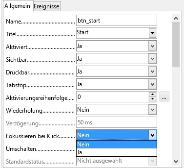

# LibreOffice Retrogames

In diesem Repository werden verschiedene Retrogames in Libreoffice Calc mittels
LibreOffice Basic umgesetzt.

## Spiele

- [Snake](Snake.md)

## Probleme

### Makrosicherheit einstellen
Damit die Makros ausgeführt werden können, muss die Makrosicherheit unter
**Extras**->**Optionen**->**LibreOffice**->**Sicherheit**->**Macrosicherheit** auf **Niedrig (nicht empfehlenswert)** gestellt werden.

### Bei betätigen der Pfeiltasten wechselt der Fokus zwischen den Formularsteuerelementen

Um zu verhindern, dass der Fokus zwischen den Formularsteuerelementen wechselt,
lässt man sich zuerst unter **Ansicht**->**Symbolleisten** die **Formular-Steuerelemente**
Symbolleiste anzeigen. Dort wechselt man dann in dem Entwurfsmodus und stellt bei
jedem Steuerelement **Fokussieren bei Klick** auf **Nein**.
